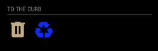
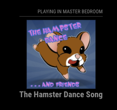
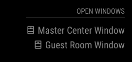

# Home Assistant Display Magic Mirror Module
## MMM-HomeAssistantDisplay

This is a module to display [Home Assistant](https://www.home-assistant.io/) information in the form of [Templates](https://www.home-assistant.io/docs/configuration/templating/) that are processed by Home Assistant ifself and then display the results on your Magic Mirror.

Templates allow you to output virtually any HTML you want to in the contents of the module.  It allows you to use the standard Jinja2 templating engine along with all of the Home Assistant custom template functions to be able to format the output of the module in whatever way you want to display it.

# Table of Contents
* [Features](#features)
* [Configuration Options](#configuration-options)
    * [Module Configuration Options](#module-configuration-options)
    * [Section Configuration Options](#section-configuration-options)
* [Examples](#examples)
    * [Simple Hiding](#simple-hiding)
    * [Media Info when Playing](#media-info-when-playing)
    * [Always Displayed with Complex Template](#always-displayed-with-complex-template)
    * [Programatic Sections](#programatic-sections)
* [License](#license)    

### Features:
* Template rendering directly in Home Assistant.
* Hiding or displaying module based on Home Assistant entity state or template render.
* Websocket connection to Home Assistant for fast response to state changes.
* Auto reconnect to Home Assistant when connection is lost.
* Custom CSS classes added to the module and every section.
* Targeted rerender of templates only on state change of watched entity.
* Material Design icons embeded in module to use with output.

### Configuration Options
#### Module Configuration Options
| Option | Description |
|---|---|
| title | Title to display at the top of the module. <br><br> **Default:** `Home Assistant` |
| host | The hostname or ip address of the Home Assistant instance. <br><br> **Default:** `REQUIRED hassio.local` |
| port | The port that Home Assistant is listening on. <br><br> **Default:** `8321` |
| useTLS | To use TLS (SSL) for the connections to Home Assistant. <br><br> **Default:** false |
| ignoreCert | Check the validity of the TLS (SSL) cert when using TLS. <br><br> **Default:** true |
| token | The long lived token. <br><br> **Default:** `REQUIRED` |
| useModuleTigger | Use a module trigger to determine if the module should be shown. <br><br> **Default:** false |
| moduleTriggerTemplate | The template to render when using the Module Trigger.  Must return **true** or **on** |
| moduleTriggerEntities | The array of entities to watch for state changes to determine if the moduleTriggerTemplate should be re-rendered. |
| animationSpeed | The animation speed to use when updating the display of the module. <br><br>**Default:** 3000 |
| class | The CSS class to add to the module `<div>` to allow for easier CSS selection.  |
| sections | The array sections of the module will try to render templates for.  See the sections config. <br><br> **Default:** [] |

#### Section Configuration Options
| Option | Description |
|---|---|
| triggerEntities | The array of entities to watch for state changes to determine if this sections displayTemplate should be re-rendered. |
| displayTemplate | The template to send to Home Assistant to render.  The results of the render will be displayed as the contents of this section in the module. |
| class | The CSS class name to add to the `<div>` surrounding this section of the module. |

### Examples

#### Simple Hiding

A Simple hiding module only displayed on Module Trigger:

This sets up a simple module that only displays the module when the binary_sensor.put_trash_out entity is set to **on**.  It will then display if the trash and/or the recycle icons need to be displayed based on the *displayTemplate*.



```javascript
{
    module: 'MMM-HomeAssistantDisplay',
    position: 'top_left',
    config: {
        host: "YOUR_HOME_ASSISTANT_HOST",
        token: "YOUR_HOME_ASSISTANT_TOKEN",
        port: 8123
        useTLS: true,
        title: "To the Curb",				
        useModuleTigger: true,
        moduleTriggerTemplate: `{{ states.binary_sensor.put_trash_out.state == "on"}}`,
        moduleTriggerEntities: ["binary_sensor.put_trash_out"],
        class: "to-the-curb",
        sections: [{
            triggerEntities: [
                "binary_sensor.put_recycle_out",
                "binary_sensor.put_trash_out"
            ],
            displayTemplate: `
                <i class='mdi mdi-trash-can'></i>
                <i class='mdi mdi-recycle'></i>
                `,
            class: "put-outs"
        }]
    },
},
```
#### Media Info when Playing

Showing playing media info only when actually playing:

This example pulls the info from a media player entity in Home Assistant.  It only shows the module when its playing and grabs the title and image url from the attributes of the media player.



```javascript
{
    module: 'MMM-HomeAssistantDisplay',
    position: 'top_right',
    config: {
        host: "YOUR_HOME_ASSISTANT_HOST",
        token: "YOUR_HOME_ASSISTANT_TOKEN",
        port: 8123
        useTLS: true,
        title: "Playing in Master Bedroom",
        useModuleTigger: true,
        moduleTriggerTemplate: `{{ states.media_player.master_bedroom_echo_show.state == "playing"}}`,
        moduleTriggerEntities: [
            "media_player.master_bedroom_echo_show"
        ],
        class: "playing_in_master",
        sections: [
            {
                triggerEntities: [
                    "media_player.master_bedroom_echo_show"
                ],
                displayTemplate: `
                <div class="image"></div>
                <div class="title">{{ states.media_player.master_bedroom_echo_show.attributes.media_title }}</div>
                `,
                class: "playing_info"
            }
        ]
    },
},
```


#### Always Displayed with Complex Template

Always displayed module with complex display template:

This example will show a complex template logic that is always displayed because it does not use the module trigger.


```javascript
{
    module: 'MMM-HomeAssistantDisplay',
    position: 'top_left',
    config: {
        host: "YOUR_HOME_ASSISTANT_HOST",
        token: "YOUR_HOME_ASSISTANT_TOKEN",
        port: 8123
        useTLS: true,				
        title: "Security",
        class: "security",
        sections: [{
                triggerEntities: [
                    "alarm_control_panel.outside_perimeter"
                ],
                displayTemplate: `
                
                
                
                
                
                
                
                
                
                
                
                
                
                <i class='mdi mdi-{{icon}}'></i> Perimeter - {{stateText}}
                `,
                class: "perimeter"
            },
        ]
    },
},
```        


#### Programatic Sections

Programatic setting of sections from long list for always displayed module:

This shows how you can use code to set the configuration for the module.  It takes a long list of entities to watch and sets each of them as a section of the module to display only when opened.



```javascript
// Top of config.js
let perimeterWindows = [
    {
        entity: "binary_sensor.front_office_window",
        name: "Front Office Window"
    },
    {
        entity: "binary_sensor.garage_window",
        name: "Garage Window"
    },
    {
        entity: "binary_sensor.dining_room_window",
        name: "Dining Room Window"
    },
    {
        entity: "binary_sensor.master_bedroom_left_window",
        name: "Master Left Window"
    },
    {
        entity: "binary_sensor.master_bedroom_center_window",
        name: "Master Center Window"
    },
    {
        entity: "binary_sensor.master_bedroom_right_window",
        name: "Master Right Window"
    },
    {
        entity: "binary_sensor.guest_room_window",
        name: "Guest Room Window"
    },
];
let perimeterWindowSections = [];
perimeterWindows.forEach((item, i) => {
    perimeterWindowSections.push({
        triggerEntities: [
            item.entity
        ],
        displayTemplate: `
        <i class='mdi mdi-window-open'></i> ${item.name}
        `,
        class: "window"
})
....
// The module entry
{       
    module: 'MMM-HomeAssistantDisplay',
    position: 'top_right',
    config: {
        host: "YOUR_HOME_ASSISTANT_HOST",
        token: "YOUR_HOME_ASSISTANT_TOKEN",
        port: 8123
        useTLS: true,
        title: "Open Windows",
        useModuleTigger: false,
        class: "windows",
        sections: [
            ...perimeterWindowSections,
        ]
    },
},
```

### License
The MIT License (MIT)
=====================

Copyright © 2016 PtrBld

Permission is hereby granted, free of charge, to any person
obtaining a copy of this software and associated documentation
files (the “Software”), to deal in the Software without
restriction, including without limitation the rights to use,
copy, modify, merge, publish, distribute, sublicense, and/or sell
copies of the Software, and to permit persons to whom the
Software is furnished to do so, subject to the following
conditions:

The above copyright notice and this permission notice shall be
included in all copies or substantial portions of the Software.

**The software is provided “as is”, without warranty of any kind, express or implied, including but not limited to the warranties of merchantability, fitness for a particular purpose and noninfringement. In no event shall the authors or copyright holders be liable for any claim, damages or other liability, whether in an action of contract, tort or otherwise, arising from, out of or in connection with the software or the use or other dealings in the software.**

